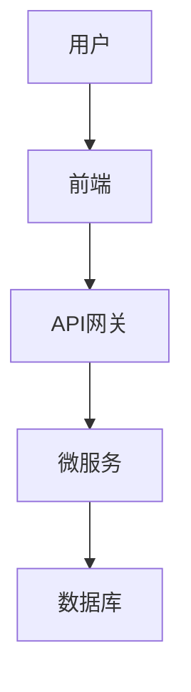

# Confluence MCP 服务器改进总结

## 概述

对现有的 Confluence MCP 服务器进行了全面的重构和改进，主要包括：

1. **按 MCP 最佳实践重构代码** ✅
2. **提升代码健壮性和错误处理** ✅  
3. **完善本地 Mermaid 渲染方案** ✅
4. **准备新功能扩展架构** ✅

## 主要改进内容

### 1. MCP 最佳实践重构 (server.py)

#### 输入验证增强
- 使用 Pydantic `BaseModel` 定义所有工具输入
- 添加字段验证（长度限制、格式校验等）
- 自动去除空白字符和验证赋值

```python
class ReadPageInput(BaseModel):
    model_config = ConfigDict(str_strip_whitespace=True, validate_assignment=True)
    page_id: str = Field(..., min_length=1, max_length=50)
    response_format: ResponseFormat = Field(default=ResponseFormat.MARKDOWN)
```

#### MCP 工具注解
- 为所有工具添加标准 MCP 注解
- 明确标识工具的只读/破坏性/幂等性特性

```python
@mcp.tool(
    name="confluence_read_page",
    annotations={
        "readOnlyHint": True,
        "destructiveHint": False,
        "idempotentHint": True,
        "openWorldHint": True,
    },
)
```

#### 响应格式支持
- 支持 JSON 和 Markdown 两种输出格式
- JSON 格式用于机器处理
- Markdown 格式用于人类阅读

### 2. 健壮性和错误处理改进 (api/client.py)

#### 重试机制
- 实现指数退避重试策略
- 可重试状态码：429, 500, 502, 503, 504
- 最多重试 3 次，延迟 1-10 秒

```python
MAX_RETRIES = 3
RETRY_DELAY_BASE = 1.0  # 基础延迟（秒）
RETRY_DELAY_MAX = 10.0  # 最大延迟（秒）
RETRYABLE_STATUS_CODES = {429, 500, 502, 503, 504}

async def _request_with_retry(self, method: str, url: str, **kwargs):
    for attempt in range(self.max_retries + 1):
        try:
            response = await self.client.request(method, url, **kwargs)
            if response.status_code in RETRYABLE_STATUS_CODES:
                if attempt < self.max_retries:
                    delay = min(RETRY_DELAY_BASE * (2 ** attempt), RETRY_DELAY_MAX)
                    await asyncio.sleep(delay)
                    continue
            return response
        except (httpx.TimeoutException, httpx.ConnectError) as e:
            # 重试逻辑
```

#### 详细错误信息
- 为不同错误类型提供具体的中文错误信息
- 包含可操作的建议和恢复步骤
- 保留原始错误详情用于调试

#### 附件上传支持
- 新增 `upload_attachment()` 方法
- 支持更新已存在的同名附件
- 新增 `get_attachments()` 方法

### 3. 本地 Mermaid 渲染方案 (converters/mermaid_local_renderer.py)

#### 智能渲染策略
- 优先使用本地 mermaid-cli (mmdc) 渲染
- 自动降级到在线渲染或代码块显示
- 支持批量渲染和上传

```python
class MermaidLocalRenderer:
    @classmethod
    def check_mmdc_available(cls) -> bool:
        """检查 mermaid-cli 是否可用"""
        return shutil.which("mmdc") is not None
    
    @classmethod
    async def render_to_file(cls, mermaid_code: str, output_path: Path):
        """渲染 Mermaid 代码为图片文件"""
        # 使用 mmdc 命令行工具
    
    @classmethod
    async def render_all_to_temp(cls, markdown_content: str):
        """批量渲染所有 Mermaid 代码块"""
        # 渲染为临时文件并上传
```

#### 集成到转换流程
- MarkdownToStorageConverter 支持异步操作
- 自动上传渲染的图片作为页面附件
- 在页面中使用 Confluence 图片标记引用

### 4. 代码质量改进

#### 类型注解
- 所有函数和方法都有完整的类型注解
- 使用 `Optional`, `List`, `Dict`, `Tuple` 等泛型

#### 文档字符串
- 所有工具都有详细的 docstring
- 包含 Args、Returns、Examples、Raises 部分
- 中文注释便于理解

#### 日志记录
- 关键操作都有日志记录
- 包含成功、失败、重试等状态
- 便于调试和监控

## 文件变更清单

### 修改的文件

1. **src/confluence_mcp/server.py** (完全重写)
   - 添加 Pydantic 输入模型
   - 添加 MCP ��具注解
   - 支持响应格式选择
   - 改进错误处理
   - 集成本地 Mermaid 渲染

2. **src/confluence_mcp/api/client.py**
   - 添加重试机制 (`_request_with_retry`)
   - 改进错误处理 (`_handle_error`)
   - 添加附件操作方法
   - 增强日志记录

3. **src/confluence_mcp/converters/markdown_to_storage.py**
   - 改为异步方法
   - 支持本地 Mermaid 渲染
   - 返回附件信息列表

### 新增的文件

1. **src/confluence_mcp/converters/mermaid_local_renderer.py**
   - 本地 Mermaid 渲染器
   - 支持 mmdc 命令行工具
   - 批量渲染和降级策略

2. **test_server.py**
   - 功能测试脚本
   - 测试所有 4 个 MCP 工具
   - 包含 Mermaid 图表测试

3. **IMPROVEMENTS.md**
   - 本文档

## 使用示例

### 创建包含 Mermaid 的页面

```python
from confluence_mcp.server import confluence_create_page, CreatePageInput

params = CreatePageInput(
    space_key="DEV",
    title="技术架构图",
    markdown_content="""
# 系统架构

## 流程图


    """,
    use_local_mermaid_render=True  # 启用本地渲染
)

result = await confluence_create_page(params)
```

### 搜索页面（JSON 格式）

```python
from confluence_mcp.server import confluence_search_pages, SearchPagesInput, ResponseFormat

params = SearchPagesInput(
    query="架构",
    space_key="DEV",
    limit=10,
    response_format=ResponseFormat.JSON  # 返回 JSON
)

result = await confluence_search_pages(params)
data = json.loads(result)
```

## 安装 mermaid-cli

要启用本地 Mermaid 渲染，需要安装 mermaid-cli：

```bash
# 使用 npm
npm install -g @mermaid-js/mermaid-cli

# 或使用 yarn
yarn global add @mermaid-js/mermaid-cli

# 验证安装
mmdc --version
```

## 环境变量配置

```bash
# .env 文件
CONFLUENCE_BASE_URL=https://wiki.example.com
CONFLUENCE_API_TOKEN=your_personal_access_token
CONFLUENCE_DEFAULT_SPACE=DEV
CONFLUENCE_TIMEOUT=30
LOG_LEVEL=INFO
```

## 测试

运行测试脚本：

```bash
# 设置环境变量
export CONFLUENCE_API_TOKEN=your_token
export CONFLUENCE_BASE_URL=https://wiki.example.com
export CONFLUENCE_DEFAULT_SPACE=TEST

# 运行测试
python test_server.py
```

## 后续扩展建议

### 短期改进
1. 添加缓存机制减少 API 调用
2. 支持批量操作（批量创建/更新）
3. 添加进度回调支持

### 新功能（Task #4）
1. **附件管理**
   - 列出页面附件
   - 下载附件
   - 删除附件

2. **评论功能**
   - 读取页面评论
   - 添加评论
   - 回复评论

3. **版本历史**
   - 查看历史版本
   - 比较版本差异
   - 恢复历史版本

4. **页面树操作**
   - 获取子页面列表
   - 移动页面
   - 复制页面

## 性能优化建议

1. **并发处理**
   - Mermaid 图表并发渲染
   - 附件并发上传

2. **缓存策略**
   - 页面内容缓存
   - 搜索结果缓存
   - Mermaid 渲染缓存

3. **资源管理**
   - 连接池管理
   - 临时文件自动清理
   - 内存使用优化

## 总结

本次改进全面提升了 Confluence MCP 服务器的代码质量、健壮性和功能完整性：

- ✅ 符合 MCP 最佳实践
- ✅ 完善的错误处理和重试机制
- ✅ 本地 Mermaid 渲染支持
- ✅ 灵活的响应格式
- ✅ 详细的日志和文档
- ✅ 为扩展新功能做好准备

代码现在更加健壮、可维护和可扩展。