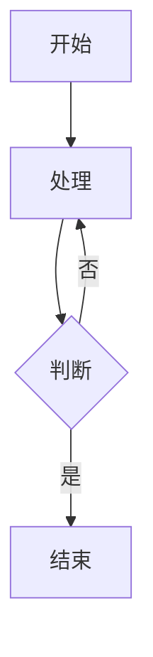

# Confluence MCP Server

基于 Python + FastMCP 的 Confluence MCP 服务器，提供通过 MCP 协议访问 Confluence API 的能力，支持 Markdown 与 Confluence Storage Format 的双向转换，特别支持 Mermaid 图表。

## 功能特性

- ✅ **读取页面**: 将 Confluence 页面转换为 Markdown 格式（含 Mermaid 代码块）
- ✅ **创建页面**: 从 Markdown 创建 Confluence 页面（Mermaid 自动转换为图片）
- ✅ **更新页面**: 更新现有页面内容
- ✅ **搜索页面**: 使用 CQL 查询搜索页面
- ✅ **Mermaid 支持**: Mermaid 图表自动转换为图片（使用 mermaid.ink，无需插件）
- ✅ **宏支持**: 支持 info/warning/code 等常用 Confluence 宏

## 安装

### 前置要求

- Python 3.10+
- Confluence Personal Access Token (PAT)

### 安装步骤

1. 克隆或下载项目

```bash
cd JiraMCP
```

2. 安装依赖

```bash
pip install -e .
```

或安装开发依赖：

```bash
pip install -e ".[dev]"
```

## 配置

### 1. 创建环境变量文件

复制 `.env.example` 为 `.env`：

```bash
cp .env.example .env
```

### 2. 配置 Confluence 连接

编辑 `.env` 文件：

```bash
# Confluence 配置
CONFLUENCE_BASE_URL=https://confluence.example.com
CONFLUENCE_API_TOKEN=your_personal_access_token_here
CONFLUENCE_DEFAULT_SPACE=YOUR_SPACE_KEY
CONFLUENCE_TIMEOUT=30

# 日志配置
LOG_LEVEL=INFO
```

### 3. 获取 Personal Access Token

1. 登录 Confluence
2. 进入 **Settings** → **Personal Access Tokens**
3. 创建新 Token，复制并保存到 `.env` 文件

## 使用方法

### 作为 MCP 服务器运行

```bash
python -m confluence_mcp.server
```

或使用命令行工具：

```bash
confluence-mcp
```

### 在 Claude Desktop 中配置

编辑 Claude Desktop 配置文件（`~/Library/Application Support/Claude/claude_desktop_config.json`）：

```json
{
  "mcpServers": {
    "confluence": {
      "command": "python",
      "args": ["-m", "confluence_mcp.server"],
      "env": {
        "CONFLUENCE_BASE_URL": "https://confluence.example.com",
        "CONFLUENCE_API_TOKEN": "your_token_here"
      }
    }
  }
}
```

重启 Claude Desktop 后即可使用。

## MCP Tools

### 1. read_confluence_page

读取 Confluence 页面并转换为 Markdown。

**参数**:
- `page_id` (str): 页面 ID

**返回**: Markdown 格式的页面内容，包含元数据头

**示例**:
```python
result = await read_confluence_page(page_id="123456")
```

### 2. create_confluence_page

从 Markdown 创建 Confluence 页面。

**参数**:
- `space_key` (str): 空间键
- `title` (str): 页面标题
- `markdown_content` (str): Markdown 内容
- `parent_id` (str, 可选): 父页面 ID

**返回**: 包含页面信息的字典

**示例**:
```python
result = await create_confluence_page(
    space_key="TEST",
    title="测试页面",
    markdown_content="# 标题\n\n内容..."
)
```

### 3. update_confluence_page

更新现有 Confluence 页面。

**参数**:
- `page_id` (str): 页面 ID
- `markdown_content` (str): 新的 Markdown 内容
- `title` (str, 可选): 新标题

**返回**: 包含更新信息的字典

**示例**:
```python
result = await update_confluence_page(
    page_id="123456",
    markdown_content="# 更新后的内容"
)
```

### 4. search_confluence_pages

搜索 Confluence 页面。

**参数**:
- `query` (str): 搜索关键词
- `space_key` (str, 可选): 限制搜索的空间
- `limit` (int, 可选): 结果数量限制（默认 25）

**返回**: 搜索结果列表

**示例**:
```python
results = await search_confluence_pages(
    query="测试",
    space_key="TEST",
    limit=10
)
```

## Mermaid 支持

### Markdown 中的 Mermaid

在 Markdown 中使用标准的 Mermaid 代码块：

````markdown
# 流程图示例


````

### 自动转换

本项目提供两种 Mermaid 支持方式：

#### 方式一：图片转换（默认，推荐）

- **创建/更新页面**: Mermaid 代码块自动转换为图片（使用 mermaid.ink）
- **优点**: 无需 Confluence 插件，兼容所有 Confluence 实例
- **适用**: 大多数场景

#### 方式二：Confluence 宏（需要插件）

- **创建/更新页面**: Mermaid 代码块转换为 Confluence Mermaid 宏
- **读取页面**: Confluence Mermaid 宏转换为 Markdown 代码块
- **要求**: Confluence 需要安装 Mermaid 插件
- **适用**: 需要在 Confluence 中直接编辑图表的场景

详细说明请参考 [Mermaid 支持文档](docs/MERMAID_SUPPORT.md)。

## 项目结构

```
JiraMCP/
├── src/confluence_mcp/
│   ├── server.py              # MCP 服务器主入口
│   ├── config.py              # 配置管理
│   ├── api/
│   │   ├── client.py          # Confluence API 客户端
│   │   └── models.py          # 数据模型
│   ├── converters/
│   │   ├── mermaid_handler.py        # Mermaid 宏转换
│   │   ├── mermaid_to_image.py       # Mermaid 图片转换
│   │   ├── storage_to_markdown.py    # Storage → Markdown
│   │   └── markdown_to_storage.py    # Markdown → Storage
│   └── utils/
│       ├── logger.py          # 日志工具
│       └── exceptions.py      # 异常定义
├── tests/                     # 单元测试
├── examples/                  # 示例文档
├── docs/                      # 文档
│   └── MERMAID_SUPPORT.md    # Mermaid 支持说明
├── pyproject.toml            # 项目配置
├── .env.example              # 环境变量模板
└── README.md                 # 本文档
```

## 开发

### 运行测试

```bash
pytest tests/ -v --cov=confluence_mcp
```

### 代码格式化

```bash
black src/
ruff check src/
```

### 类型检查

```bash
mypy src/
```

## 故障排除

### 认证失败

**错误**: `AuthenticationError: Authentication failed`

**解决**:
1. 检查 `CONFLUENCE_API_TOKEN` 是否正确
2. 确认 Token 未过期
3. 验证 Token 有足够的权限

### 页面未找到

**错误**: `NotFoundError: Resource not found`

**解决**:
1. 确认页面 ID 正确
2. 检查是否有访问权限
3. 验证空间键是否正确

### 转换错误

**错误**: `ConversionError: ...`

**解决**:
1. 检查 Markdown 格式是否正确
2. 确认 Mermaid 语法有效
3. 查看日志获取详细错误信息

## 限制和已知问题

1. **宏支持**: 目前仅支持常用宏（mermaid, code, info, warning），其他宏可能无法正确转换
2. **附件**: 暂不支持附件上传/下载
3. **评论**: 暂不支持页面评论功能
4. **版本历史**: 暂不支持查看历史版本

## 后续计划

- [ ] 附件支持
- [ ] 评论功能
- [ ] 版本历史查看
- [ ] 批量操作
- [ ] 更多宏支持
- [ ] 模板支持

## 许可证

MIT License

## 贡献

欢迎提交 Issue 和 Pull Request！

## 联系方式

如有问题或建议，请通过 GitHub Issues 联系。
