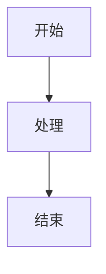

# Mermaid 图表支持说明

## 问题背景

Confluence 支持 Mermaid 图表需要安装专门的插件。如果 Confluence 实例没有安装 Mermaid 插件，直接使用 `<ac:structured-macro ac:name="mermaid">` 宏会显示为 "unknown-macro" 占位符。

## 解决方案

本项目提供两种 Mermaid 支持方式：

### 方案一：图片转换（推荐，默认）

将 Mermaid 代码转换为图片链接，使用 [mermaid.ink](https://mermaid.ink) 服务。

**优点**：
- ✅ 无需 Confluence 插件
- ✅ 兼容所有 Confluence 实例
- ✅ 图片可以正常显示
- ✅ 支持在线编辑（提供 Mermaid Live Editor 链接）

**缺点**：
- ⚠️ 依赖外部服务（mermaid.ink）
- ⚠️ 图片是静态的，不能在 Confluence 中直接编辑

**使用方法**：

```python
from confluence_mcp.converters.markdown_to_storage import MarkdownToStorageConverter

converter = MarkdownToStorageConverter()
# 默认使用图片方式
storage_content = converter.convert(markdown_content)
# 或显式指定
storage_content = converter.convert(markdown_content, use_mermaid_images=True)
```

### 方案二：Confluence 宏（需要插件）

使用 Confluence 原生的 Mermaid 宏。

**优点**：
- ✅ 原生支持，可以在 Confluence 中编辑
- ✅ 不依赖外部服务

**缺点**：
- ❌ 需要 Confluence 安装 Mermaid 插件
- ❌ 如果插件未安装，会显示为 "unknown-macro"

**使用方法**：

```python
from confluence_mcp.converters.markdown_to_storage import MarkdownToStorageConverter

converter = MarkdownToStorageConverter()
storage_content = converter.convert(markdown_content, use_mermaid_images=False)
```

## 转换示例

### 输入（Markdown）

```markdown
## 流程图


```

### 输出（方案一：图片）

```html
<h2>流程图</h2>
<p></p>
```

### 输出（方案二：宏）

```xml
<h2>流程图</h2>
<ac:structured-macro ac:name="mermaid">
  <ac:plain-text-body><![CDATA[
graph TD
    A[开始] --> B[���理]
    B --> C[结束]
  ]]></ac:plain-text-body>
</ac:structured-macro>
```

## 检查 Confluence 是否支持 Mermaid 宏

运行以下脚本检查：

```python
import asyncio
from confluence_mcp.api.client import ConfluenceClient

async def check_mermaid_support():
    async with ConfluenceClient() as client:
        # 创建测试页面
        test_content = '''
        <ac:structured-macro ac:name="mermaid">
          <ac:plain-text-body><![CDATA[graph TD; A-->B;]]></ac:plain-text-body>
        </ac:structured-macro>
        '''
        page = await client.create_page(
            space_key="YOUR_SPACE",
            title="Mermaid 测试",
            body_storage=test_content
        )

        # 读取页面
        read_page = await client.get_page(page.id)

        if 'unknown-macro' in read_page.storage_content:
            print("❌ Confluence 不支持 Mermaid 宏，请使用图片方式")
        else:
            print("✅ Confluence 支持 Mermaid 宏")

asyncio.run(check_mermaid_support())
```

## MCP 工具使用

MCP 工具默认使用图片方式：

```python
# 通过 MCP 创建页面
await create_confluence_page(
    space_key="TEST",
    title="测试页面",
    markdown_content="""
    # 测试

    ```mermaid
    graph TD
        A --> B
    ```
    """
)
# Mermaid 会自动转换为图片
```

## 相关文件

- `src/confluence_mcp/converters/mermaid_to_image.py` - Mermaid 转图片转换器
- `src/confluence_mcp/converters/mermaid_handler.py` - Mermaid 宏转换器（原生方式）
- `src/confluence_mcp/converters/markdown_to_storage.py` - Markdown 转换主入口
- `examples/create_with_mermaid_images.py` - 图片方式示例
- `examples/create_from_markdown.py` - 宏方式示例（需要插件）

## 技术细节

### mermaid.ink 编码

使用 pako 压缩算法（zlib）+ Base64 编码：

```python
import base64
import zlib

def encode_mermaid(code: str) -> str:
    compressed = zlib.compress(code.encode('utf-8'), level=9)
    encoded = base64.urlsafe_b64encode(compressed).decode('utf-8')
    return f"https://mermaid.ink/img/{encoded}?type=png"
```

### Mermaid Live Editor 链接

```python
live_editor_url = f"https://mermaid.live/edit#pako:{encoded}"
```

## 常见问题

**Q: 为什么我的 Mermaid 图表显示为 "unknown-macro"？**

A: 你的 Confluence 实例没有安装 Mermaid 插件。请使用图片方式（默认）。

**Q: 图片方式的图表可以编辑吗？**

A: 不能在 Confluence 中直接编辑，但可以：
1. 在 Markdown 源文件中编辑
2. 使用提供的 Mermaid Live Editor 链接在线编辑
3. 重新上传更新后的 Markdown

**Q: mermaid.ink 服务可靠吗？**

A: mermaid.ink 是 Mermaid 官方提供的图片渲染服务，稳定可靠。如果担心外部依赖，可以考虑：
1. 自建 mermaid.ink 服务
2. 使用 Confluence Mermaid 插件（需要安装）

**Q: 如何切换回宏方式？**

A: 在转换时设置 `use_mermaid_images=False`：

```python
converter.convert(markdown_content, use_mermaid_images=False)
```
