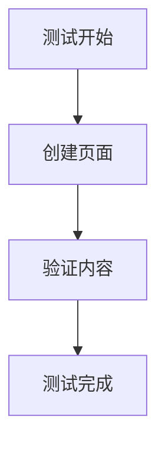

# 安全测试配置指南

## 目标

限制 MCP 服务器只能在你的个人空间的特定页面下操作，避免影响其他内容。

## 配置步骤

### 1. 找到你的个人空间和测试页面

1. 登录 Confluence (https://confluence.example.com)
2. 进入你的个人空间（通常是 `~username` 格式）
3. 创建一个专门的测试页面，例如：
   - 标题：`MCP 测试区域`
   - 内容：可以留空或添加说明

4. 获取页面信息：
   - 打开测试页面
   - 查看 URL，格式类似：`https://confluence.example.com/pages/viewpage.action?pageId=123456`
   - 记录 `pageId`（例如：123456）
   - 记录空间键（个人空间通常是 `~username`）

### 2. 配置环境变量

编辑 `.env` 文件：

```bash
# Confluence 配置
CONFLUENCE_BASE_URL=https://confluence.example.com
CONFLUENCE_API_TOKEN=your_personal_access_token

# 测试配置 - 限制操作范围
CONFLUENCE_DEFAULT_SPACE=~your_username  # 你的个人空间
CONFLUENCE_TEST_PARENT_PAGE_ID=123456    # 测试页面 ID

# 日志配置
LOG_LEVEL=INFO
```

### 3. 创建安全测试脚本

创建 `examples/safe_test.py`：

```python
"""安全测试脚本 - 只在指定页面下操作"""
import asyncio
import os
from confluence_mcp.api.client import ConfluenceClient
from confluence_mcp.converters.markdown_to_storage import MarkdownToStorageConverter


async def safe_test():
    """安全测试 - 只在测试页面下创建子页面"""

    # 从环境变量获取配置
    test_space = os.getenv("CONFLUENCE_DEFAULT_SPACE")
    test_parent_id = os.getenv("CONFLUENCE_TEST_PARENT_PAGE_ID")

    if not test_space or not test_parent_id:
        print("❌ 请先配置 CONFLUENCE_DEFAULT_SPACE 和 CONFLUENCE_TEST_PARENT_PAGE_ID")
        return

    print(f"🔒 安全测试模式")
    print(f"   空间: {test_space}")
    print(f"   父页面 ID: {test_parent_id}")
    print()

    # 测试内容
    test_markdown = """
# 测试页面

这是一个自动创建的测试页面。

## Mermaid 图表测试



## 功能验证

- ✅ Markdown 转换
- ✅ Mermaid 支持
- ✅ 页面创建

**注意**: 这是测试页面，可以安全删除。
"""

    async with ConfluenceClient() as client:
        try:
            # 1. 验证父页面存在
            print("1️⃣  验证父页面...")
            parent_page = await client.get_page(test_parent_id)
            print(f"   ✅ 父页面: {parent_page.title}")
            print(f"   ✅ 空间: {parent_page.space.key}")
            print()

            # 2. 创建测试子页面
            print("2️⃣  创建测试子页面...")
            converter = MarkdownToStorageConverter()
            storage_content = converter.convert(test_markdown)

            new_page = await client.create_page(
                space_key=test_space,
                title="MCP 自动测试 - 可删除",
                body_storage=storage_content,
                parent_id=test_parent_id  # 重要：指定父页面
            )

            print(f"   ✅ 页面创建成功!")
            print(f"   页面 ID: {new_page.id}")
            print(f"   标题: {new_page.title}")
            print(f"   URL: https://confluence.example.com{new_page.web_url}")
            print()

            # 3. 读取验证
            print("3️⃣  读取页面验证...")
            read_page = await client.get_page(new_page.id)
            print(f"   ✅ 读取成功: {read_page.title}")
            print()

            # 4. 更新测试
            print("4️⃣  更新页面测试...")
            updated_markdown = test_markdown + "\n\n## 更新测试\n\n页面已更新。"
            updated_storage = converter.convert(updated_markdown)

            updated_page = await client.update_page(
                page_id=new_page.id,
                title=new_page.title,
                body_storage=updated_storage,
                version_number=new_page.version.number if new_page.version else 1
            )
            print(f"   ✅ 更新成功! 版本: {updated_page.version.number if updated_page.version else 'N/A'}")
            print()

            print("✅ 所有测试完成!")
            print(f"\n📝 测试页面已创建在: {parent_page.title} 下")
            print(f"🔗 访问: https://confluence.example.com{new_page.web_url}")
            print(f"\n💡 提示: 测试完成后可以手动删除测试页面")

        except Exception as e:
            print(f"❌ 测试失败: {e}")


if __name__ == "__main__":
    asyncio.run(safe_test())
```

### 4. 运行安全测试

```bash
# 1. 确保已配置 .env
cat .env

# 2. 运行安全测试
python examples/safe_test.py
```

### 5. Claude Desktop 安全配置

在 Claude Desktop 配置中，你可以通过提示词来限制操作范围：

```json
{
  "mcpServers": {
    "confluence": {
      "command": "python",
      "args": ["-m", "confluence_mcp.server"],
      "env": {
        "CONFLUENCE_BASE_URL": "https://confluence.example.com",
        "CONFLUENCE_API_TOKEN": "your_token_here",
        "CONFLUENCE_DEFAULT_SPACE": "~your_username",
        "CONFLUENCE_TEST_PARENT_PAGE_ID": "123456"
      }
    }
  }
}
```

然后在使用时，明确告诉 Claude：

```
请只在我的个人空间（~username）的测试页面（ID: 123456）下创建子页面。
不要修改其他任何页面。
```

## 安全建议

### ✅ 推荐做法

1. **使用个人空间**
   - 个人空间只有你可以访问
   - 不会影响团队内容

2. **创建专门的测试页面**
   - 标题明确标注"测试"
   - 在该页面下创建所有测试子页面

3. **限制 Token 权限**
   - 创建 Token 时只授予必要权限
   - 定期轮换 Token

4. **使用 parent_id 参数**
   - 创建页面时始终指定 `parent_id`
   - 确保新页面在测试区域下

5. **测试后清理**
   - 测试完成后删除测试页面
   - 保持空间整洁

### ⚠️ 注意事项

1. **不要在生产空间测试**
   - 避免在团队共享空间测试
   - 避免在重要文档区域测试

2. **小心更新操作**
   - 更新前确认页面 ID
   - 避免误更新重要页面

3. **搜索操作**
   - 搜索时使用 `space_key` 参数限制范围
   - 例如：`space_key="~username"`

## 测试流程示例

### 完整的安全测试流程

```bash
# 1. 配置环境
cp .env.example .env
# 编辑 .env，填入配置

# 2. 验证配置
python -c "
import os
from dotenv import load_dotenv
load_dotenv()
print(f'空间: {os.getenv(\"CONFLUENCE_DEFAULT_SPACE\")}')
print(f'测试页面: {os.getenv(\"CONFLUENCE_TEST_PARENT_PAGE_ID\")}')
"

# 3. 运行安全测试
python examples/safe_test.py

# 4. 检查结果
# 访问 Confluence 查看测试页面

# 5. 清理（可选）
# 手动删除测试页面
```

## 在 Claude Desktop 中安全使用

### 示例对话

**用户**:
```
我想测试 Confluence MCP 功能。
请只在我的个人空间 ~your_username 的测试页面（ID: 123456）下操作。
创建一个测试子页面。
```

**Claude 会**:
1. 使用 `create_confluence_page` 工具
2. 指定 `space_key="~your_username"`
3. 指定 `parent_id="123456"`
4. 创建页面在测试区域下

### 限制搜索范围

**用户**:
```
搜索我个人空间中包含"测试"的页面
```

**Claude 会**:
1. 使用 `search_confluence_pages` 工具
2. 指定 `space_key="~your_username"`
3. 只返回个人空间的结果

## 故障恢复

如果不小心创建了错误的页面：

1. **通过 Confluence Web 界面删除**
   - 找到页面
   - 点击 "..." → "删除"

2. **查看页面历史**
   - 如果误更新了页面
   - 可以恢复到之前的版本

3. **联系管理员**
   - 如果需要恢复重要内容
   - 管理员可以从回收站恢复

## 总结

通过以上配置，你可以：
- ✅ 安全地测试所有功能
- ✅ 不影响其他内容
- ✅ 随时清理测试数据
- ✅ 完全控制操作范围

**记住**: 始终在个人空间的测试页面下操作！
