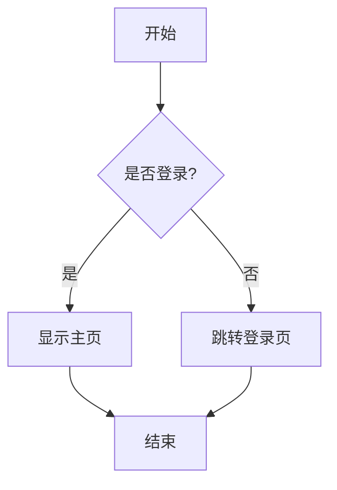
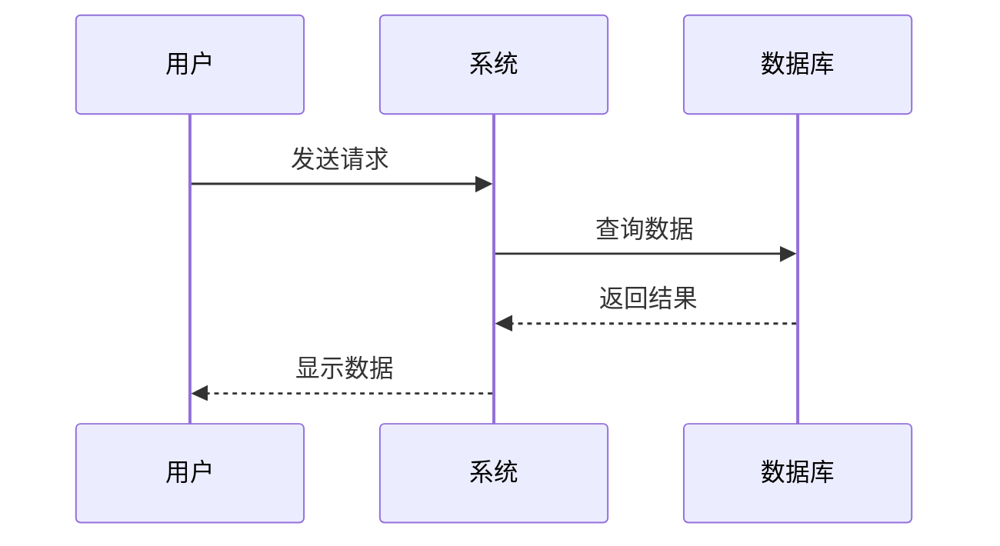
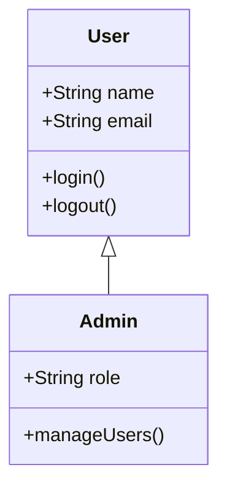
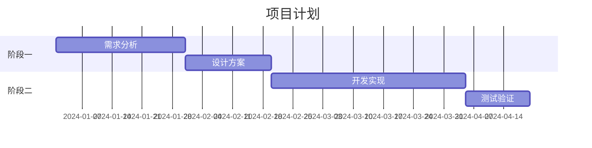

# 示例页面

这是一个演示 Confluence MCP 服务器功能的示例页面。

## 基本格式

支持标准的 Markdown 格式：

- **粗体文本**
- *斜体文本*
- `代码片段`
- [链接](https://example.com)

### 列表

有序列表：
1. 第一项
2. 第二项
3. 第三项

无序列表：
- 项目 A
- 项目 B
- 项目 C

## 代码块

### Python 代码

```python
def hello_world():
    print("Hello, Confluence!")
    return True
```

### JavaScript 代码

```javascript
function greet(name) {
    console.log(`Hello, ${name}!`);
}
```

## Mermaid 图表

### 流程图



### 序列图



### 类图



### 甘特图



## 表格

| 功能 | 状态 | 优先级 |
|------|------|--------|
| 读取页面 | ✅ 完成 | 高 |
| 创建页面 | ✅ 完成 | 高 |
| 更新页面 | ✅ 完成 | 高 |
| 搜索页面 | ✅ 完成 | 中 |
| 附件支持 | ⏳ 计划中 | 低 |

## 引用块

> 这是一个普通的引用块。
> 可以包含多行内容。

## 特殊宏

### Info 信息框

> ℹ️ Info: 这是一个信息提示框，用于显示重要信息。

### Warning 警告框

> ⚠️ Warning: 这是一个警告框，用于提醒用户注意事项。

## 总结

这个示例展示了 Confluence MCP 服务器支持的各种 Markdown 格式，特别是 Mermaid 图表的支持。
